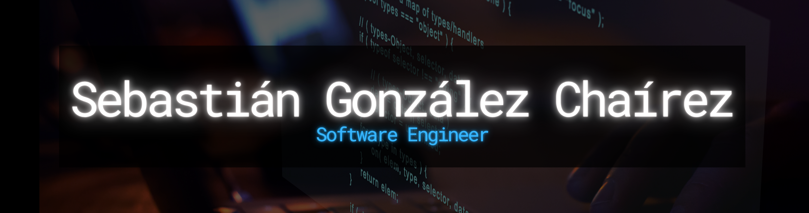

  

---

<table>
  <tr>
    <td width="60%" valign="top">

# 👋 About Me

Computer Systems Engineering student, ERP Implementation Consultant, and technical project lead focused on transforming complex business requirements into reliable software.

My experience spans ERP implementation, enterprise automation, and full-stack product development. I also led a six-person Scrum team in the delivery of ARMON-IA, an AI-assisted emotional wellness platform developed across three repositories.

## 🔭 Currently

- Leading an end-to-end Odoo ERP implementation and digital transformation across 10 core business workflows.
- Working at the intersection of enterprise systems, software engineering, and technical project leadership.

## 🏆 Competitions & Hackathons

**2025:** ICPC Mexico Finals • ICPC TXST Texas–México • TecNM Coding Cup • HackMty • Hackathon Laguna Inteligente • DataWeek UAC Programming Competition

**2024:** TecNM Coding Cup • ITSA Programming Contest • CEMEX Hackathon at MTY

&nbsp;

   </td>

   <!-- Columna derecha – CONNECT WITH ME -->
   <td width="40%" valign="top">

# 📬 Connect with me
- 📄 **Download my CV** [[PDF](https://github.com/Sebaxg86/Sebaxg86/blob/main/CV.pdf)]  
- 🔗 **LinkedIn** [[cbaxplus](https://www.linkedin.com/in/cbaxplus/)]  
- ✉️ Reach me at: **sebax86@icloud.com**

   </td>
  </tr>
</table>

---

# 🗂️ Portfolio
> Link: (work in progress…)

---

# 💻 Tech Stack

<table>
<tr>
<td width="50%" valign="top">

### 🧠 Programming Languages

### 📱 Frontend & Mobile

### 🏢 Enterprise & Automation

</td>
<td width="50%" valign="top">

### 🔧 Backend & APIs

### 🤖 AI & Orchestration

### 🗄️ Databases & Cloud

### ⚙️ DevOps & Delivery

</td>
</tr>
</table>

---

# 📊 GitHub Stats

  

  
  

  

---
